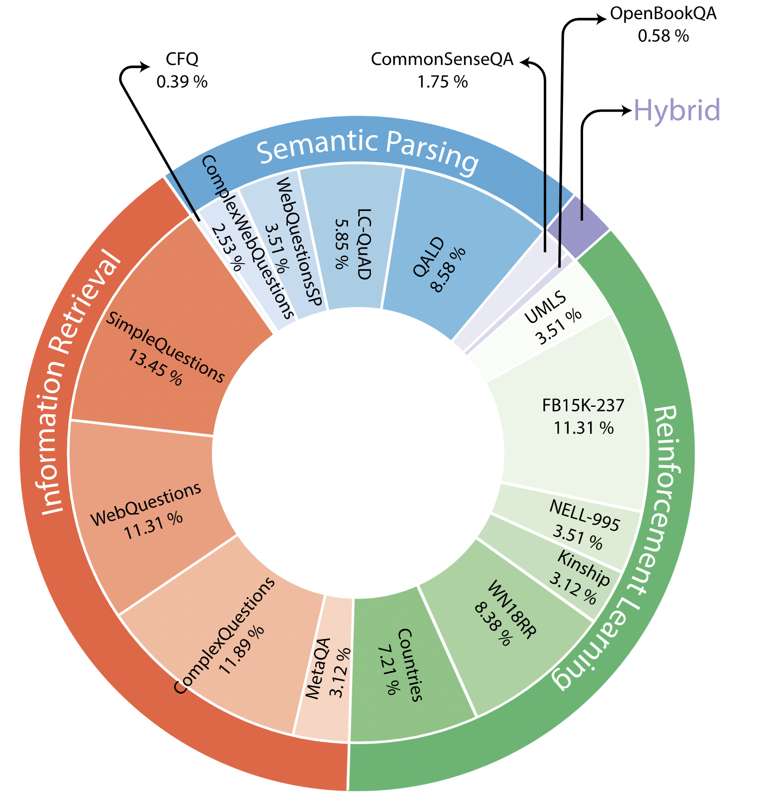

# Relation Extraction

Relation Extraction (RE) is the procedure used to detect the relations between various entities in (unstructured/unlabelled) texts. RE is a very actively researched field and there have been a lot of very interesting papers and promising algorithms proposed in the recent years along with a multitude of high quality datasets. 

This repositories goal is to provide an overview of the current research challenges and how they are adressed. 

If some links appear broken, you can feel free to update that link and issue a pull request. (Or you can just notify me, that's fine too.)

## Surveys:

1. [(Bach and Badaskar, 2007) A Review of Relation Extraction](https://www.cs.cmu.edu/~nbach/papers/A-survey-on-Relation-Extraction.pdf)
2. [(de Abreu et al., 2013) A review on Relation Extraction with an eye on Portuguese](https://link.springer.com/article/10.1007/s13173-013-0116-8)
3. [(Konstantinova, 2014) Review of Relation Extraction Methods: What is New Out There?](https://citeseerx.ist.psu.edu/viewdoc/download?doi=10.1.1.727.1005&rep=rep1&type=pdf)
4. [(Asghar, 2016) Automatic Extraction of Causal Relations from Natural Language Texts: A Comprehensive Survey](https://arxiv.org/pdf/1605.07895.pdf)
5. [(Kumar, 2017) A Survey of Deep Learning Methods for Relation Extraction](https://arxiv.org/pdf/1705.03645)
6. [(Pawar et al., 2017) Relation extraction: A survey](https://arxiv.org/abs/1712.05191)
7. [(Cui et al., 2017) A Survey on Relation Extraction](https://books.google.de/books?hl=en&lr=&id=o-FHDwAAQBAJ&oi=fnd&pg=PA50&ots=fzj45p0LGl&sig=4jszWDQYxbhRU2y5kqUubk2l8Kc&redir_esc=y#v=onepage&q&f=false)
8. [(Chakraborty et al., 2019) Introduction to Neural Network based Approaches for Question Answering over Knowledge Graphs](https://arxiv.org/pdf/2007.13069.pdf)
9. [(Han et al., 2020) More Data, More Relations, More Context and More Openness: A Review and Outlook for Relation Extraction](https://arxiv.org/pdf/2004.03186.pdf)
10. [(Fu et al., 2020) A Survey on Complex Question Answering over Knowledge Base: Recent Advances and Challenges](https://arxiv.org/pdf/2007.13069.pdf)
11. [(Yang et al., 2021) A Survey on Extraction of Causal Relations from Natural Language Text](https://arxiv.org/pdf/2101.06426)
12. [(Nayak et al., 2021) Deep Neural Approaches to Relation Triplets Extraction: A Comprehensive Survey](https://arxiv.org/pdf/2103.16929)
13. [(Wang et al., 2021) Deep Neural Network Based Relation Extraction: An Overview](https://arxiv.org/pdf/2101.01907)
14. [(Aydar et al., 2021) Neural Relation Extraction: A Review](https://journals.tubitak.gov.tr/elektrik/issues/elk-21-29-2/elk-29-2-35-2005-119.pdf)
15. [(Pawar et al., 2021) Techniques for Jointly Extracting Entities and Relations A Survey](https://arxiv.org/pdf/2103.06118)
16. [(Lan et al., 2021) A Survey on Complex Knowledge Base Question Answering: Methods, Challenges and Solutions](https://arxiv.org/pdf/2105.11644.pdf)

## Knowledge Graphs / Knowledge Bases
1. DBpedia [Website](https://www.dbpedia.org) / [GitHub](https://github.com/dbpedia/) / [Paper](http://svn.aksw.org/papers/2013/SWJ_DBpedia/public.pdf)
2. Freebase [Website](https://developers.google.com/freebase) / DEPRECATED / [Paper](https://dl.acm.org/doi/10.1145/1376616.1376746)
3. YAGO [Website](https://yago-knowledge.org) / [Latest Release](https://yago-knowledge.org/downloads/yago-4) / [Paper](https://suchanek.name/work/publications/eswc-2020-yago.pdf)
4. Wikidata [Website](https://www.wikidata.org/wiki/Wikidata:Main_Page) / [Paper](https://dl.acm.org/doi/pdf/10.1145/2629489)

## Datasets:

Here is a distribution of some of the most used datasets showing their usage frequency in over 550 papers.

   

If you created a new dataset or found something missing, please don't hesitate to create a pull request to add it here.

1. Datasets for Semantic Parsing
   1. LC-QuAD [Paper](http://lc-quad.sda.tech/static/ISWC2017_paper_152.pdf) / [Website](http://lc-quad.sda.tech) / [Repository](https://github.com/AskNowQA/LC-QuAD) 
   1. LC-QuAD 2.0 [Paper](http://jens-lehmann.org/files/2019/iswc_lcquad2.pdf) / [Website](http://lc-quad.sda.tech)
   1. ComplexWebQuestions [Paper](https://arxiv.org/pdf/1803.06643.pdf) / [Website](https://www.tau-nlp.org/compwebq) 
   1. WebQuestionsSP [Paper](https://aclanthology.org/P16-2033.pdf) / [Download](https://www.microsoft.com/en-us/download/details.aspx?id=52763)
   1. QALD Series [Website](http://qald.aksw.org/)
   1. CompositionalFreebaseQuestions (CFQ) [Paper](https://arxiv.org/pdf/1912.09713.pdf) / [Repository](https://github.com/google-research/google-research/tree/master/cfq) 

1. Datasets for Information Retrieval
   1.  SimpleQuestions [Paper](https://arxiv.org/pdf/1506.02075v1.pdf) / [Repository](https://github.com/davidgolub/SimpleQA/tree/master/datasets/SimpleQuestions)
   1. WebQuestions [Paper](https://aclanthology.org/D13-1160.pdf) / [Website](https://nlp.stanford.edu/software/sempre/)
   1. ComplexQuestions (unfortunately, there are 2 datasets with the same name <i>ComplexQuestions</i>)
      1. ComplexQuestions (sometimes referred to as <i>CompQ</i>) [Paper](https://aclanthology.org/C16-1236.pdf) / [Repository](https://github.com/JunweiBao/MulCQA/tree/ComplexQuestions)
      1. ComplexQuestions [Paper](https://dl.acm.org/doi/10.1145/3038912.3052583) / [Website](https://worksheets.codalab.org/worksheets/0x91d77db37e0a4bbbaeb37b8972f4784f) – Note that the dataset was provided by a different author
   1. MetaQA [Paper](https://arxiv.org/abs/1709.04071) / [Repository](https://github.com/yuyuz/MetaQA)

1. Datasets for Reinforcement Learning
   1. UMLS [Paper](https://dl.acm.org/doi/10.1145/1273496.1273551) / [Repository](https://github.com/shehzaadzd/MINERVA/tree/master/datasets/data_preprocessed/umls) ([MINERVA](https://arxiv.org/abs/1711.05851) Repository)
   1. NELL-995 [Paper](https://arxiv.org/abs/1707.06690) / [Repository](https://github.com/shehzaadzd/MINERVA/tree/master/datasets/data_preprocessed/nell-995) ([MINERVA](https://arxiv.org/abs/1711.05851) Repository)
   1. Kinship [Paper](https://dl.acm.org/doi/10.1145/1273496.1273551) / [Repository](https://github.com/shehzaadzd/MINERVA/tree/master/datasets/data_preprocessed/kinship) ([MINERVA](https://arxiv.org/abs/1711.05851) Repository)
   1. FB15K-237 [Paper (Original FB15K)](https://proceedings.neurips.cc/paper/2013/file/1cecc7a77928ca8133fa24680a88d2f9-Paper.pdf) / [Paper (FB15K-237 Variant)](https://aclanthology.org/D15-1174.pdf) / [Download (FB15K-237)](https://www.microsoft.com/en-us/download/details.aspx?id=52312)
   1. WN18RR [Paper](https://ojs.aaai.org/index.php/AAAI/article/view/11573) / [Repository](https://github.com/TimDettmers/ConvE/blob/master/WN18RR.tar.gz)
   1. Countries [Paper](https://www.semanticscholar.org/paper/On-Approximate-Reasoning-Capabilities-of-Low-Rank-Bouchard-Singh/03dfada96b88c741bb26bd4ce7b5ae4232157d37) / [Repository](https://github.com/shehzaadzd/MINERVA/tree/master/datasets/data_preprocessed/countries_S1) ([MINERVA](https://arxiv.org/abs/1711.05851) Repository)

1. Datasets for Hybrid KGQA
   1. CommonSenseQA [Paper](https://arxiv.org/abs/1811.00937) / [Website](https://www.tau-nlp.org/commonsenseqa)
   1.  OpenBookQA [Paper](https://arxiv.org/abs/1809.02789) / [Website](https://allenai.org/data/open-book-qa)

## Performance Leaderboard per Dataset

When reporting the results of your approach, make sure to be as precise as possible. You would be surprised, how many papers report ambiguous results. If your approach outperforms everyone else for a certain benchmark, make sure to mark it bold.

P = Precision

(Definition)

R = Recall

(Definition)

F = F1

(Definition)

RE = Relation Extraction Subtask

*This metric refers solely to the RE subtask, i.e. how well can you find the correct relations. This metric is different from E2E.*

E2E = End to End

*This metric shows the result of running your algorithm **end to end** on the dataset's test set. End to end means **the whole process** from start to finish.*

 

---

### 1. [QALD-Series](#h_qald)
### 2. [LC-QuAD](#h_lcquad)
### 3. [FreebaseQA](#h_freebaseqa)
### 4. [SimpleQuestion & SQB](#h_simplequestions)
### 5. [WebQuestion & Derivatives](#h_webquestions)
### 6. [Free917](#h_free917)
### 7. [ComplexQuestions](#h_complexquestions)
### 8. [MetaQA](#h_metaqa)
### 9. [PathQuestion](#h_pathquestion)
### 10. [MSF](#h_msf)
### 11. [NYT](#h_nyt)
### 12. [CommonsenseQA, OpenbookQA & ComplexWebQuestions](#h_hyb)
### 13. [Reinforcement Learning Datasets](#h_rl)
### 14. [KBC](h_kbc)
### 15. [PQA](h_pqa)

---

 

## QALD-Series

|      |          [QALD-5](#qald)          | 
|:----:|:------------------------:|
| [HCqa (Asadifar et al., 2019)](https://arxiv.org/abs/1811.10986)* | P = 0.7   R = 1.0   F = 0.81 |

*) Tested only on 10 questions

|      |          [QALD-6](#qald)         |
|:----:|:------------------------:|
| [HCqa (Asadifar et al., 2019)](https://arxiv.org/abs/1811.10986)* | P = 0.42   R = 0.42   F = 0.52 |

*) Tested only on 25 questions

|       |              [QALD-7](#qald)               |
|:-----:|:--------------------------------:|
| [SLING (Mihindukulasooriya et al., 2020)](https://arxiv.org/abs/2009.07726) | P = 0.57   R = 0.76   F = 0.65   |
| [EARL (Dubey et al., 2018)](https://arxiv.org/abs/1801.03825)  | RE = 0.47  |
| [GGNN (Sorokin and Gurevych, 2018)](https://aclanthology.org/C18-1280/)  | P = 0.2686   R = 0.3179   F = 0.2588  |

|       |              [QALD-9](#qald)               |
|:-----:|:--------------------------------:|
| [SLING (Mihindukulasooriya et al., 2020)](https://arxiv.org/abs/2009.07726) |    P = 0.50   R = 0.64   F = 0.56  |

 

---

 

## LC-QuAD

|       |              [LC-QuAD 1](#lcquad1)            |
|:-----:|:--------------------------------:|
| [SLING (Mihindukulasooriya et al., 2020)](https://arxiv.org/abs/2009.07726) |    P = 0.41   R = 0.44   F = 0.48  |
| [EARL (Dubey et al., 2018)](https://arxiv.org/abs/1801.03825) |     RE = 0.36    |

 

---

 

## FreebaseQA

|       | FreebaseQA ([Paper](https://aclanthology.org/N19-1028/) / [Repository](https://github.com/kelvin-jiang/FreebaseQA) )            |
|:-----:|:--------------------------------:|
| [Retrieve and Re-rank (Wang et al., 2021)](https://aclanthology.org/2021.eacl-main.26/) | E2E = 0.517 |

 

---

 

## SimpleQuestions

|       |              [SimpleQuestions](#simplequestions)    |
|:-----:|:--------------------------------:|
| [AdvT-MMRD (Zhang et al., 2020)](https://ieeexplore.ieee.org/document/9050788) | RE = 0.938   E2E = 0.790 |
| [MLTA (Wang et al., 2019)](https://ieeexplore.ieee.org/document/8684200)  | RE = 0.824  |
| [Question Matching (Abolghasemi et al., 2020)](https://arxiv.org/abs/2002.07715) | RE = 0.9341 |
| [Relation Splitting (Hsiao et al., 2017)](https://aclanthology.org/I17-1098/)  | RE = 0.9341   E2E = 0.767 |
| [KSA-BiGRU (Zhu et al., 2019)](https://arxiv.org/abs/1912.11668)  | P = 0.867   R = 0.848   F = 0.849   RE = 0.9341   E2E = 0.731 |
| [Alias Matching (Buzaaba and Amagasa, 2021)](https://link.springer.com/article/10.1007/s42979-020-00421-7) | RE = 0.8288   E2E = 0.7464 |
| [Synthetic Data (Sidiropoulos et al., 2020)](https://arxiv.org/abs/2005.12040) | RE* (unseen domain) = 0.7041   E2E (seen domain) = 0.77   E2E* (unseen domain) = 0.6657 |
| [Transfer Learning with BERT (Lukovnikov et al., 2020)](https://arxiv.org/abs/2001.11985) | RE = 0.836   E2E = 0.773 |
| [Retrieve and Re-rank (Wang et al., 2021)](https://aclanthology.org/2021.eacl-main.26/) | E2E = 0.797 |
| [HR-BiLSTM (Yu et al., 2017)](https://aclanthology.org/P17-1053/) | RE = 0.933 E2E = 0.787|
| [Multi-View Matching (Yu et al., 2018)](https://arxiv.org/abs/1803.00612) | RE = 0.9375 |

*) Average of Micro + Macro

|       |              SimpleQuestions-Balanced ([Paper](https://aclanthology.org/P19-1616/) / [Repository](https://github.com/wudapeng268/KBQA-Adapter))   |
|:-----:|:--------------------------------:|
| [HR-BiLSTM (Yu et al., 2017)](https://aclanthology.org/P17-1053/) | RE* (seen) = 0.891   RE*(unseen) = 0.412   RE*(seen+unseen avg.) = 0.673 |
| [Representation Adapter (Wu et al., 2019)](https://aclanthology.org/P19-1616/) | RE* (seen) = 0.8925   RE*(unseen) = 0.7515   RE*(seen+unseen avg.) = 0.83 |

*) Average of Micro + Macro

 

---

 

## WebQuestions + Derivatives

|       |              [WebQuestions](#webquestions)           |
|:-----:|:--------------------------------:|
| [Support Sentences (Li et al., 2017)](http://ceur-ws.org/Vol-1883/paper_8.pdf) |    P = 0.572   R = 0.396   F = 0.382   E2E = 0.423 |
| [QARDTE (Zheng et al., 2018)](https://journals.plos.org/plosone/article?id=10.1371/journal.pone.0205097) | P = 0.512   R = 0.613   F = 0.558   RE = 0.843 |
| [HybQA (Mohamed et al., 2017)](https://pdfs.semanticscholar.org/f433/54ef2348e4330939ad2dbf90395e925ceb4f.pdf) | F = 0.57 |

|       |              [WebQuestionsSP](webquestionssp)           |
|:-----:|:--------------------------------:|
| [HR-BiLSTM (Yu et al., 2017)](https://aclanthology.org/P17-1053/) | RE = 0.8253 |
| [UHOP (Chen et al., 2019)](https://arxiv.org/abs/1904.01246) (w/ HR-BiLSTM) | RE = 0.8260 |
| [OPQL (Sun et al., 2021)](https://arxiv.org/abs/2102.07043) | RE = 0.8540   E2E = 0.519 |
| [Multi-View Matching (Yu et al., 2018)](https://arxiv.org/abs/1803.00612) | RE = 0.8595 |
| [Masking Mechanism (Chen et al., 2018)](https://www.springerprofessional.de/en/relation-extraction-in-knowledge-base-question-answering-from-ge/15917004) | RE = 0.77 |

|       |              WebQuestionsSP-WD ([Paper](https://aclanthology.org/C18-1280/) / [Repository](https://github.com/UKPLab/coling2018-graph-neural-networks-question-answering))  |
|:-----:|:--------------------------------:|
| [GGNN (Sorokin and Gurevych, 2018)](https://aclanthology.org/C18-1280/) | P = 0.2686   R = 0.3179   F = 0.2588 |

 

---

 

## Free917

|       |              Free917 ([Original Paper](https://aclanthology.org/P13-1042/) / [Data](https://nlp.stanford.edu/software/sempre/))          |
|:-----:|:--------------------------------:|
| [QARDTE (Zheng et al., 2018)](https://journals.plos.org/plosone/article?id=10.1371/journal.pone.0205097) | P = 0.683   R = 0.679   F = 0.663 |

 

---

 

## ComplexQuestions

|       |              [ComplexQuestions](#complexquestions)            |
|:-----:|:--------------------------------:|
| [HCqa (Asadifar et al., 2019)](https://arxiv.org/abs/1811.10986) | F = 0.536 |

 

---

 

## MetaQA

|       |              [MetaQA](#metaqa) |
|:-----:|:--------------------------------:|
| [OPQL (Sun et al., 2021)](https://arxiv.org/abs/2102.07043) | E2E (2-Hop) = 0.885   E2E (3-Hop) = 0.871 |
| [RDAS (Wang et al., 2021)](https://arxiv.org/abs/2104.00218) | E2E (1-Hop) = 0.991   E2E (2-Hop) = 0.97   E2E (3-Hop) = 0.856 |
| [Incremental Sequence Matching (Lan et al., 2019)](https://ieeexplore.ieee.org/document/8970943) | F = 0.981   E2E (1-Hop) = 0.963   E2E (2-Hop) = 0.991   E2E (3-Hop) = 0.996 |

 

---

 

## PathQuestion

|       |              PathQuestion ([Paper](https://aclanthology.org/C18-1171/) / [Repository](https://github.com/zmtkeke/IRN))|
|:-----:|:--------------------------------:|
| [Incremental Sequence Matching (Lan et al., 2019)](https://ieeexplore.ieee.org/document/8970943) | F = 0.96   E2E = 0.967 |
| [RDAS (Wang et al., 2021)](https://arxiv.org/abs/2104.00218) | E2E (2-Hop) = 0.736   E2E (3-Hop) = 0.910 |

 

---

 

## MSF

|       |              MSF ([Paper](https://openreview.net/pdf?id=SJxstlHFPH) / [Repository](https://github.com/google-research/language/tree/master/language/labs/drkit))|
|:-----:|:--------------------------------:|
| [OPQL (Sun et al., 2021)](https://arxiv.org/abs/2102.07043) | E2E (2-Hop) = 0.492   E2E (3-Hop) = 0.297 |

 

---

 

## NYT

|       |              NYT ([Paper](https://link.springer.com/content/pdf/10.1007/978-3-642-15939-8_10.pdf) / [Data](https://iesl.cs.umass.edu/riedel/ecml/)) |
|:-----:|:--------------------------------:|
| [Deep RL (Qin et al., 2018)](https://aclanthology.org/P18-1199/) | F* = 0.778 |
| [ReQuest (Wu et al., 2018)](https://arxiv.org/abs/1710.11169) | P = 0.404 R = 0.48 F = 0.439 |

*) Average

 

---

 

## Hybrid QA

|       |              [ComplexWebQuestions](#complexwebquestions) |
|:-----:|:--------------------------------:|
| [OPQL (Sun et al., 2021)](https://arxiv.org/abs/2102.07043) | E2E = 0.407 |

|       |              [OpenBookQA](#openbookqa) |
|:-----:|:--------------------------------:|
| [MHGRN (Feng et al., 2020)](https://arxiv.org/abs/2005.00646) | E2E = 0.806 |
| [QA-GNN (Yasunaga et al., 2021)](https://arxiv.org/abs/2104.06378) | E2E = 0.828 |

|       |              [CommonsenseQA](#commonsenseqa) |
|:-----:|:--------------------------------:|
| [MHGRN (Feng et al., 2020)](https://arxiv.org/abs/2005.00646) | E2E = 0.765 |
| [QA-GNN (Yasunaga et al., 2021)](https://arxiv.org/abs/2104.06378) | E2E = 0.761 |

 

---

 

## Reinforcment Learning

|       |              [Kinship](#kinship) |
|:-----:|:--------------------------------:|
| [MINERVA (Das et al., 2018)](https://arxiv.org/abs/1711.05851) | E2E = 0.605 |
| [Reward Shaping (Lin et al., 2018)](https://arxiv.org/abs/1808.10568) | E2E = 0.811 |

|       |              [UMLS](#umls) |
|:-----:|:--------------------------------:|
| [MINERVA (Das et al., 2018)](https://arxiv.org/abs/1711.05851) | E2E = 0.728 |
| [Reward Shaping (Lin et al., 2018)](https://arxiv.org/abs/1808.10568) | E2E = 0.902 |

|       |              [Countries](#countries) |
|:-----:|:--------------------------------:|
| [MINERVA (Das et al., 2018)](https://arxiv.org/abs/1711.05851) | E2E* = 0.9582 |

*) Average of S1, S2 and S3

|       |              [WN18RR](#wn18rr) |
|:-----:|:--------------------------------:|
| [MINERVA (Das et al., 2018)](https://arxiv.org/abs/1711.05851) | E2E* = 0.413 |
| [Reward Shaping (Lin et al., 2018)](https://arxiv.org/abs/1808.10568) | E2E = 0.437 |

|       |              [FB15K-237](#fb15k) |
|:-----:|:--------------------------------:|
| [MINERVA (Das et al., 2018)](https://arxiv.org/abs/1711.05851) | E2E* = 0.217 |
| [Reward Shaping (Lin et al., 2018)](https://arxiv.org/abs/1808.10568) | E2E = 0.329 |

|       |              [NELL-995](#nell995) |
|:-----:|:--------------------------------:|
| [MINERVA (Das et al., 2018)](https://arxiv.org/abs/1711.05851) | E2E* = 0.663 |
| [Reward Shaping (Lin et al., 2018)](https://arxiv.org/abs/1808.10568) | E2E = 0.656 |

 

---

 

## KBC

|       |              KBC ([Paper](https://arxiv.org/abs/1607.01426) / [Repository](https://rajarshd.github.io/ChainsofReasoning/)) |
|:-----:|:--------------------------------:|
| [ROP (Yin et al., 2018)](https://arxiv.org/abs/1806.04523) | E2E* = 0.7616 |

*) Here: the mean average precision

 

---

 

## PQA

|       |              PQA ([Paper](https://aclanthology.org/D15-1038/) / [Repository](https://worksheets.codalab.org/worksheets/0xfcace41fdeec45f3bc6ddf31107b829f)) |
|:-----:|:--------------------------------:|
| [ROP (Yin et al., 2018)](https://arxiv.org/abs/1806.04523) | E2E* = 0.907 |

 

---

 

## SimpleQuestions

## Research Challenges:

For each solution to a challenge, a short description is provided. If you write a paper, that deals with these challenges, you can create a pull request and add a link to your paper with a short description of the paper. If it fits to no challenge provided here, you may create a new entry and add your paper there. 

